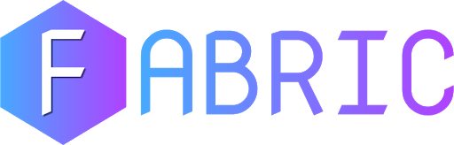

<p align="center">
  
</p>
<h3 align="center"><i>Connecting teachers and students through an interactive whiteboard</i></h3>
<p align="center">
  
  
  
  
  
  
</p>
<hr>

## 🚀 Local Development

```sh
git clone https://github.com/RGBHack/Fabric.git
pip install -r requirements.txt
python3 app.py
```

## 💻 Try it out

Video Demo: [https://youtu.be/-joH96WRY5s](https://youtu.be/-joH96WRY5s)<br>
DevPost: [https://devpost.com/software/fabric-vsf4wn](https://devpost.com/software/fabric-vsf4wn)<br>
Slides Presentation: [bit.ly/fabric-slides](https://docs.google.com/presentation/d/1KUOVSg-vXgk2qqnBOHsNrnV4RrTOQe21Gyw9d69k5Ks/edit?usp=sharing)<br>

## 👨‍💻 Authors

**Safin Singh, Rohan Juneja, Aadit Gupta, Raadwan Masum**


## 🤝 Contributing

Contributions, PRs, issues and feature requests are welcome! Feel free to check out our [issues page](https://github.com/RGBHack/Fabric/issues). 

## ❤️ Show your support

Give a ⭐️ if this project helped you!
Hope you enjoy!

